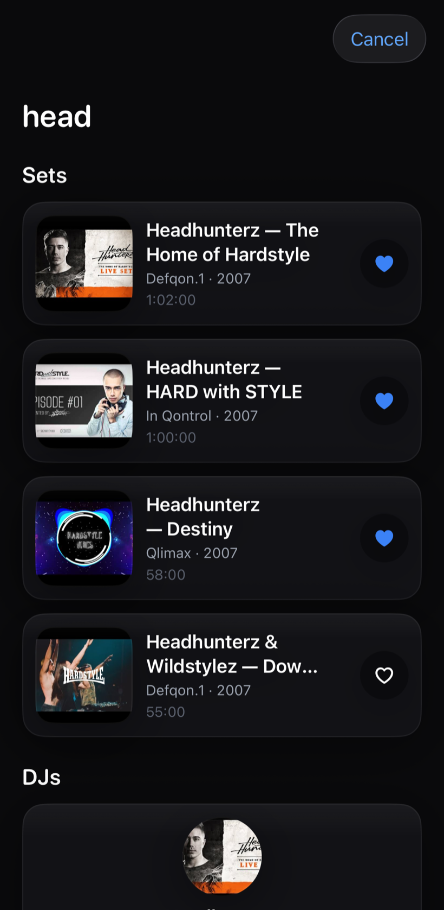
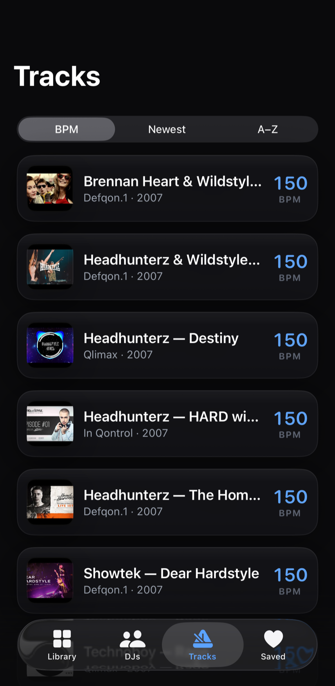
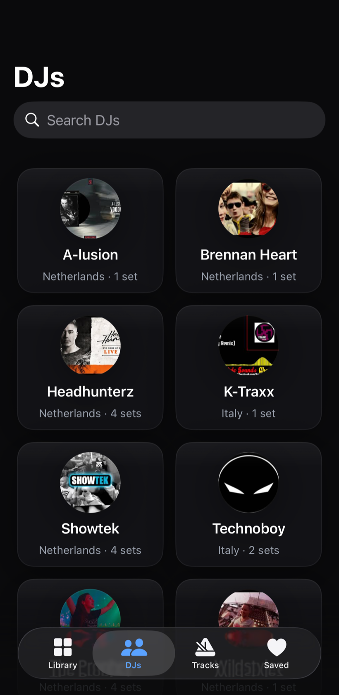
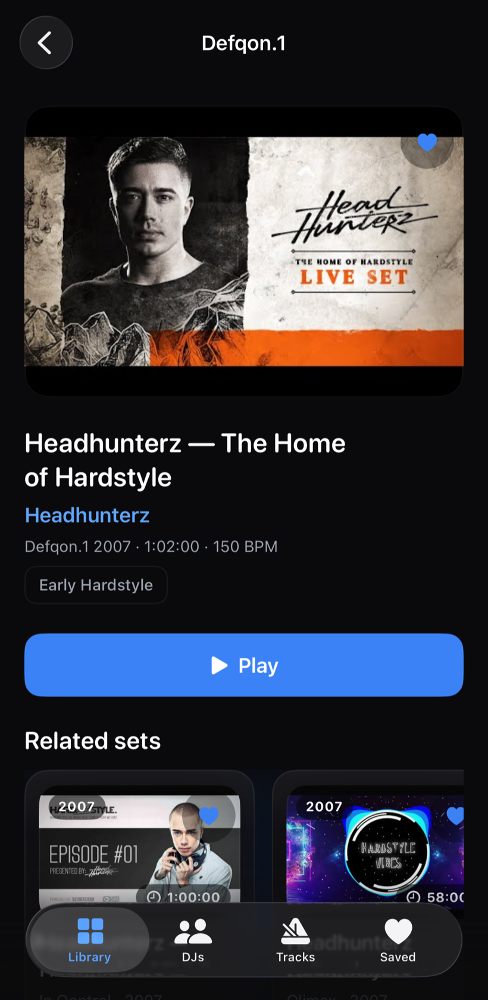
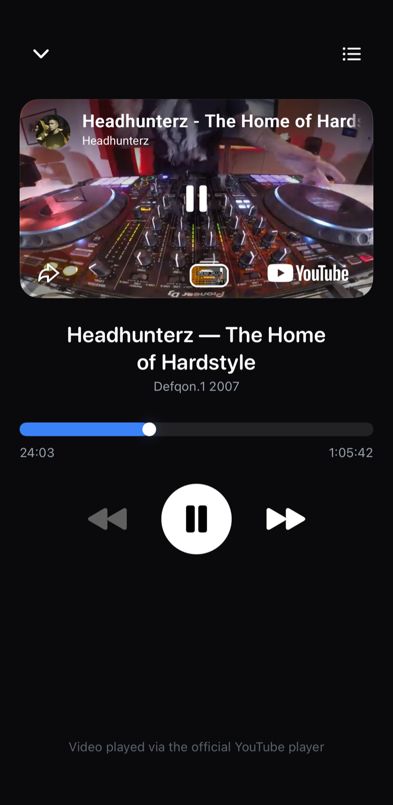
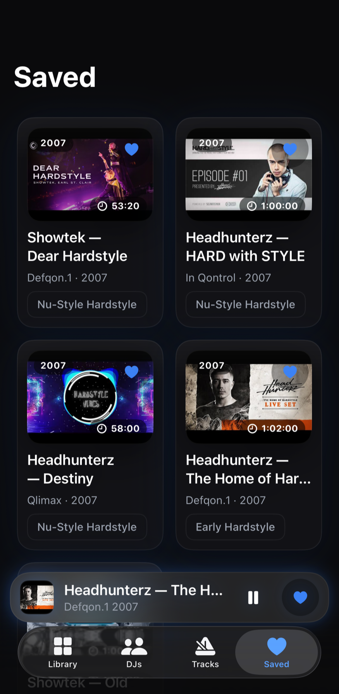
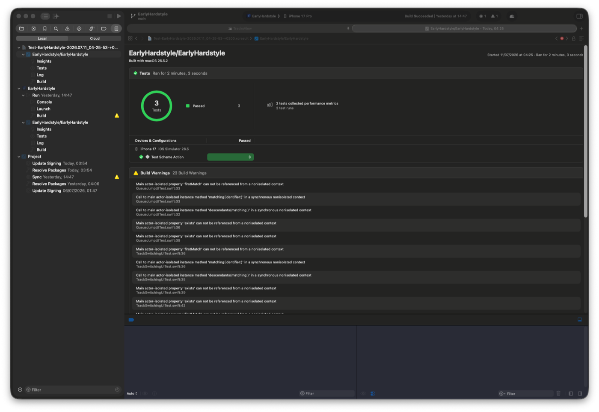

# Early Hardstyle iOS application

A native iOS catalogue of the golden era of early hardstyle (1999–2007): legendary sets, DJs and events — with full playback, a queue and a personal library. Swift 6 · SwiftUI · MVVM.

## Screens

| Library | Search | Tracks | DJs |
|:--:|:--:|:--:|:--:|
|  |  |  |  |
| Hero, a "Jump back in" resume rail and the set grid with search + filters. | Full-screen cover with grouped results: sets, DJs, events. | Every set with its BPM — sort by BPM, newest or A–Z. | DJ grid with real artwork, country and set count. |

| Set detail | Player | Saved |
|:--:|:--:|:--:|
|  |  |  |
| Artwork, metadata, genres and related sets — the entry point to playback. | Official YouTube player with seek, queue and explicit buffering/error states. | Favourites on device, with the persistent mini-player docked above the tab bar. |

## Features

- **Playback** — official YouTube embed behind a `PlaybackEngine` protocol, plus a native `AVPlayer` engine for licensed audio with background playback and lock-screen Now Playing + remote commands
- **Mini-player & queue** — playback is app-level, so the mini-player persists across tabs and the queue autoplays the next set
- **Resume** — long sets remember their position and resume where you left off
- **Search & filters** — grouped global search, plus year / event / genre / country filters
- **System integration** — "Set of the Day" widget, Siri shortcut and `earlyhs://` deep links

## Architecture

- **MVVM + DI** — dumb views, logic in `@Observable` ViewModels, every dependency injected via initialisers from a single composition root; no singletons
- **Modules** — a local Swift Package: `Core` (models), `Services` (catalog, favourites, progress), `DesignSystem` (tokens + components), `Features` (View + ViewModel pairs); features depend on protocols, not concretions
- **Explicit state machines** — every screen models `loading / loaded / empty / failed(retryable)`; the player models `idle / loading / buffering / playing / paused / ended / failed`
- **Concurrency** — structured `async/await`, `@MainActor` UI, cancellation handled
- **Telemetry** — privacy-respecting `Analytics` + `CrashReporter` abstractions (no-op/console defaults, no PII)
- **Localization-ready** — user-facing copy lives in String Catalogs (`.xcstrings`) behind typed `L10n` accessors per module; ships English-only, and adding a language is a catalog-only change
- The `.xcodeproj` is generated from `project.yml` and never committed

## Getting started

```bash
brew install xcodegen
xcodegen generate
open EarlyHardstyle.xcodeproj   # run the EarlyHardstyle scheme (iOS 17+)
```

## Testing & quality

- 120+ unit tests — ViewModels (happy/failure/edge), services, decoding and the player state machine (`EarlyHardstyleKit-Package` scheme, iOS Simulator)
- End-to-end XCUI tests, including a real-playback probe, a background-audio proof and the screenshot tour that regenerates the images above
- SwiftLint (`--strict`) + SwiftFormat; GitHub Actions lints, builds and tests every PR

## Performance

Measured with XCTest's performance metrics (the same counters Instruments
reports), 5 iterations each — `PerfMetricsTests`, Debug build, iPhone 17
simulator (iOS 26.5):

| Metric | Result | Notes |
|---|---|---|
| App launch | **1.06 s** avg (±1.3%) | `XCTApplicationLaunchMetric`, cold-ish launch to a usable Library |
| Launch → real playback | **4.43 s** avg (±1.6%) | full cold path: WebKit prewarm, deferred web view load, YouTube iframe, autoplay + watchdog — to the `playing` state |
| Memory (browse) | ~267 MB RSS | Library with hero mesh, Liquid Glass and artwork loaded |
| Memory (playback) | ~285 MB RSS peak | 40 s YouTube session; steady ≈270 MB |



Reproduce locally:

```bash
xcodebuild test -scheme EarlyHardstyle \
  -destination 'platform=iOS Simulator,name=iPhone 17' \
  -only-testing:EarlyHardstyleUITests/PerfMetricsTests
```

## License

Proprietary — all rights reserved. This repository is public temporarily, for demonstration and code-review purposes only; copying, reuse or redistribution of the code is not permitted. See [LICENSE](LICENSE).
