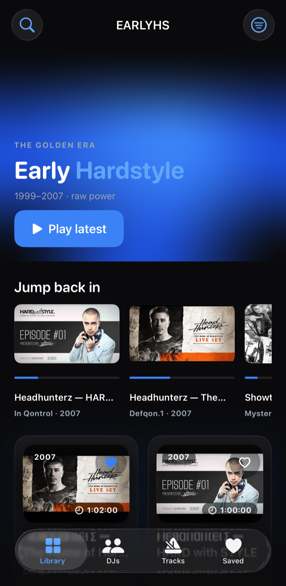

# Early Hardstyle — iOS

> A native iOS app cataloguing the golden era of early hardstyle (1999–2007): DJs, legendary sets and events, with browse, search, filters, a personal **Saved** library, and full playback through the **official YouTube player**. Built to a production, senior-iOS standard with **MVVM**, strict module boundaries and dependency injection throughout.

<p align="center">
  
</p>

> Tribute project — not affiliated with any labels, events or artists. Playback happens inside YouTube's own embedded player; no media is ripped or self-hosted.

---

## Highlights

- **Modular architecture** — a local Swift Package splits the app into `Core`, `Services`, `DesignSystem` and `Features`, with a strict dependency direction and features depending on **protocols, not concretions**.
- **MVVM + DI** — dumb views, logic in `@Observable` ViewModels, all collaborators injected from a single composition root. No hidden singletons in testable code.
- **Explicit state machines** — every screen models `loading / loaded / empty / failed(retryable)` explicitly; the player models `idle / loading / buffering / playing / paused / ended / failed`.
- **Official YouTube playback** — Google's official `youtube-ios-player-helper` (the maintained iframe-player wrapper), behind a `YouTubePlayer` protocol so the state machine is unit-tested with a mock.
- **App-level playback** — a `PlaybackController` owns the queue and current player, so a **persistent mini-player** rides above the tab bar and the **queue** drives autoplay across the whole app.
- **Persistence** — favourites survive launches via a `UserDefaults`-backed store behind the `FavouritesService` protocol.
- **Telemetry** — privacy-respecting `Analytics` + `CrashReporter` abstractions with no-op/console defaults, injected everywhere.
- **i18n-ready** — user-facing copy lives in **String Catalogs** (`.xcstrings`) behind typed `L10n` accessors per module; the app ships English-only, and adding a language is a catalog-only change.
- **Quality** — 120+ unit tests, SwiftLint (`--strict`) + SwiftFormat, and GitHub Actions CI (lint + build + test on a simulator) on every PR.

---

## Architecture

```
early-hardstyle-ios/
├── project.yml               XcodeGen spec — the .xcodeproj is generated, never committed
├── App/                      thin app target: entry point + DI composition root
│   ├── Sources/              EarlyHardstyleApp, AppDependencies (composition root)
│   └── Resources/            Assets (AccentColor, AppIcon)
├── Packages/Modules/         local Swift Package — the app's real code
│   └── Sources/
│       ├── Core/             models, telemetry protocols, typed errors (no UI)
│       ├── Services/         catalog/favourites services (protocols + impls + mocks) + seed
│       ├── DesignSystem/     tokens, components, 3D/motion modifiers, styleguide
│       └── Features/         screen View + ViewModel pairs, and app-level playback
├── .github/workflows/ci.yml  lint + build + test on every PR
├── CLAUDE.md                 engineering operating manual
└── DESIGN.md                 UI/UX single source of truth
```

**Dependency direction:** `Features → DesignSystem / Services / Core`. Features and screens depend on **protocols** (`CatalogService`, `FavouritesService`, `YouTubePlayer`, `Analytics`, `CrashReporter`); concrete implementations are constructed in exactly one place — `App/Sources/AppDependencies.swift` — and injected downstream via initialisers. Every module runs under the **Swift 6 language mode**.

### Why a generated project

The `.xcodeproj` is produced by [XcodeGen](https://github.com/yonaskolb/XcodeGen) from `project.yml` and is **git-ignored**. This keeps the repo free of merge-conflict-prone project files and makes the build configuration reviewable as plain YAML.

### Playback design

```
PlaybackController (app-level, @Observable)
  ├─ owns the queue + current PlayerViewModel, drives autoplay
  ├─ shared via the SwiftUI environment (mini-player persists across tabs)
  └─ PlayerViewModel ── depends on ──▶ YouTubePlayer (protocol)
                                         ├─ OfficialYouTubePlayer (Google's youtube-ios-player-helper)
                                         └─ MockYouTubePlayer    (drives tests)
```

The engine adapts `YTPlayerView`'s delegate callbacks into `PlaybackEvent`s. Because the ViewModel only knows the protocol, the entire play/pause/seek/buffering/ended/error/autoplay logic is exercised without any web view.

---

## Features

| # | Feature | What it does |
|---|---------|--------------|
| 1 | Project scaffold | XcodeGen, SPM modules, SwiftLint/SwiftFormat, CI, DI root |
| 2 | Telemetry | `Analytics` + `CrashReporter` abstractions, wired first |
| 3 | Models & services | Codable domain models, `CatalogService`/`FavouritesService`, typed errors |
| 4 | Design system | Tokens, components, 3D/motion (tilt/pulse/mesh), debug styleguide |
| 5 | Library | Set-card grid, animated hero, search, explicit states |
| 6 | Library filters | Year / event / genre / country facets |
| 7 | DJs | Grid + DJ detail with the DJ's sets |
| 8 | Saved | Persistent favourites + designed empty state |
| 9 | Set detail | Metadata, related sets, play entry point |
| 10 | YouTube player | Official iframe player + full state machine |
| 11 | Mini-player + queue | Persistent mini-player, queue, autoplay |
| 12 | Seed content | Real DJs/sets with official YouTube ids |
| 13 | Hardening | Typed error mapping, player load-failure states, a11y |

Design tokens, screen maps and the motion language live in [`DESIGN.md`](DESIGN.md): minimalist **black / white / electric blue**, with 3D used as depth and motion — never as gimmick, and always degrading gracefully under Reduce Motion.

---

## Getting started

Requirements: **Xcode 16+** (developed on Xcode 26) and the tools below.

```bash
# one-time: install tooling
brew install xcodegen swiftlint swiftformat

# generate the Xcode project (whenever project.yml or the file tree changes)
xcodegen generate
open EarlyHardstyle.xcodeproj
```

### Command line

```bash
# build the app
xcodebuild build -project EarlyHardstyle.xcodeproj -scheme EarlyHardstyle \
  -destination 'platform=iOS Simulator,name=iPhone 17 Pro'

# run the module tests
cd Packages/Modules && xcodebuild test -scheme EarlyHardstyleKit-Package \
  -destination 'platform=iOS Simulator,name=iPhone 17 Pro'

# lint / format check
swiftformat . --lint
swiftlint lint --strict
```

---

## Run on your iPhone (no simulator needed, incl. wirelessly)

You only need **Xcode 16+** and a **free Apple ID** — no paid developer account. (Playback also works on the simulator; a device just sounds better. 🎧)

1. **Generate & open** the project:
   ```bash
   brew install xcodegen          # once
   xcodegen generate
   open EarlyHardstyle.xcodeproj
   ```
2. **Signing** (once): select the **EarlyHardstyle** target → **Signing & Capabilities** → set **Team** to your Apple ID. Add your Apple ID first under *Xcode ▸ Settings ▸ Accounts* if it isn't listed. Xcode uses *Automatic* signing, so it provisions the app for you.
   - If it complains the bundle id is taken, change `PRODUCT_BUNDLE_IDENTIFIER` in `project.yml` to something unique (e.g. `com.yourname.EarlyHardstyle`), run `xcodegen generate`, and re-open.
3. **Prepare the iPhone** (once): on the phone, *Settings ▸ Privacy & Security ▸ Developer Mode ▸ On* (it reboots). Connect the iPhone to the Mac by cable and tap **Trust** on the phone.
4. **Enable wireless** (once): *Xcode ▸ Window ▸ Devices and Simulators ▸* select your iPhone *▸* tick **“Connect via network.”** You can now unplug the cable — the phone stays available over Wi‑Fi (same network as the Mac).
5. **Run:** pick your iPhone (e.g. *iPhone 16 Pro Max*) in the run-destination menu and press **⌘R**. On first launch, on the phone: *Settings ▸ General ▸ VPN & Device Management ▸* trust your developer certificate, then reopen the app.

Notes:
- The app needs **internet** — set artwork comes from YouTube thumbnails and playback is the official YouTube player.
- **Backgrounding:** the app declares the `audio` background mode and an active playback audio session, but WebKit suspends embedded YouTube video in the background (background play is gated by YouTube itself) — so playback pauses when you leave and **resumes automatically when you return**. No app can keep playing after being force-quit.
- With a **free** Apple ID the signature expires after **7 days**; just rebuild from Xcode to renew. A paid Apple Developer account removes the limit.
- Minimum iOS is **17.0**, so any modern iPhone works.

---

## Testing

120+ XCTest cases, focused where the logic lives:

- **ViewModels** — happy / empty / error(retryable + non-retryable) / recovery paths, search, filtering, favourites, analytics (Library, DJs, DJ detail, Saved, Set detail).
- **Player & queue** — the full player state machine via a mock engine; queue lifecycle, autoplay on/off, bounds, reorder/remove index-preservation, current-save persistence.
- **Services** — favourites persistence across instances, catalogue decoding (incl. malformed input + Codable round-trip), typed-error mapping, and seed integrity (unique/valid ids, references, artwork).
- **Design system** — the hex colour parser and spoken-duration/label helpers.

Test doubles (`MockCatalogService`, `InMemoryFavouritesService`, `MockYouTubePlayer`) ship with the modules so ViewModels are trivially isolatable. Concurrency follows Swift 6 discipline (`@MainActor` ViewModels, actor-backed stores, lock-guarded spies).

---

## Quality gates & CI

Every PR runs [`CI`](.github/workflows/ci.yml): **SwiftFormat** (lint mode) + **SwiftLint** (`--strict`), an app build, and the full module test suite on an iOS simulator. Green CI is required to merge; every feature ships as its own branch and squash-merged PR.

---

## Accessibility & performance

- Dynamic Type throughout (type tokens map to text styles); VoiceOver labels on cards, badges, controls and the mini-player.
- Reduce Motion disables tilt/parallax/mesh-drift and the now-playing pulse, falling back to opacity/scale.
- Lazy grids/stacks, `visualEffect`-friendly motion, and URL-derived artwork with branded placeholders keep scrolling smooth.

---

## Debugging Lab

A record of deliberately introduced, theme-matched bugs, each paired with a fix and the test that catches it — see [`DEBUGGING_LAB.md`](DEBUGGING_LAB.md).

| Bug | Caught by | Broken | Fix |
|---|---|---|---|
| Reversed catalogue ordering | `test_load_success_populatesNewestFirst` | `lab/broken-reverse-ordering` | `lab/fix-reverse-ordering` |
| Player progress NaN | `test_progress_withZeroDuration_isNotScrubbable` | `lab/broken-player-progress-nan` | `lab/fix-player-progress-nan` |

## Roadmap

Planned work — headlined by **true background & lock-screen playback** via a licensed `AVPlayer` audio engine behind the existing `YouTubePlayer` protocol seam — lives in [`docs/ROADMAP.md`](docs/ROADMAP.md), together with prioritised feature candidates (resume long sets, recently played, search screen, App Intents/widgets, sleep timer, Metal visualizer).
